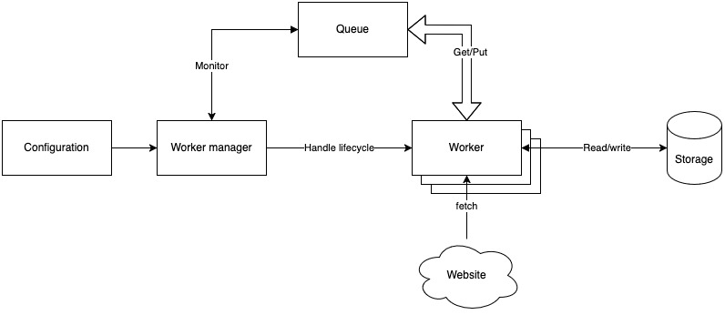
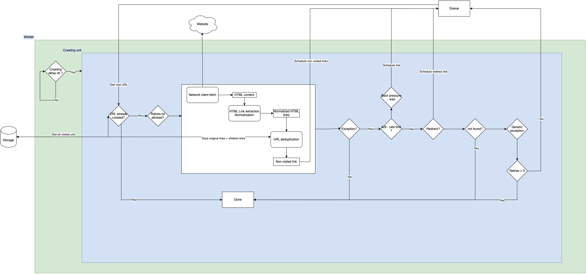

# Web Crawler
A simple asynchronous web crawler built with Python that respects robots.txt and implements rate limiting.

## Features
- Asynchronous operation using asyncio
- Respects robots.txt rules
- Rate limiting and backoff strategy
- JSON storage for crawled URLs
- Logging and monitoring
- Automatic retry mechanism


## Usage
Basic usage:

Requires python 3.13

```bash
python main.py \
    --url https://example.com \
    --workers 5 \
    --max-retries 3 \
    --backoff 5
```

### Command Line Arguments
- `--url`: Starting URL to crawl
- `--workers`: Number of concurrent workers (default: 1)
- `--max-retries`: Maximum retry attempts (default: 3)
- `--backoff`: Backoff time in seconds (default: 5)

## Tests

Run tests using the following command

```bash
pytest
```

## Technical Details

### Architecture

#### Web crawler 


#### Worker



#### Component Sharing
The current implementation uses shared instances of network clients and utility components across workers. This approach was chosen for:

*Pros*:
- Easier mocking in tests
- Simpler implementation for a time-bounded project
- Reduced complexity as utils are stateless and functional

*Cons:*
- Potential bottlenecks with shared resources
- Less worker autonomy

#### Future Improvements
Each worker could be made fully autonomous by:
- Creating independent network clients per worker
- Implementing worker-specific utility instances
- Decoupling shared dependencies


## Trade-offs

### Concurrency
Python offers 3 types of concurrency
- Multi-processing
- Multi-threading
- Coroutines

To decide which one I need in this use case we need to understand if our application is 
- **CPU bound**: Processing time determined by CPU speed
- **I/O bound**: Processing time determiner by input/output operations

In this use case, the application makes requests to the internet and saves data to files, it is then I/O bound. Adding more CPU would not make it faster.

I then have 2 choices 
- Multi-threading (parallelism) using the threading API or ThreadPoolExecutor (concurrent futures)
- Coroutines using AsyncIO


#### Multi-threading
*Pros:*
- True parallel execution
- Simpler for blocking operations
- Works well with existing synchronous code
- Preemptive multitasking

*Cons:*
- Higher memory overhead
- Complex state management
- Risk of race conditions

### Asyncio Coroutines
*Pros:*
- Excellent for I/O-bound tasks
- Lower memory footprint
- No thread synchronization needed
- Better performance for network operations
- Cooperative multitasking
- Efficient for handling 1000s+ of small tasks

*Cons:*
- Requires async-compatible libraries
- More complex error handling
- Steeper learning curve


### Choice 
**I decided to use AsyncIO for this project based on the use case and AsyncIO offerings.**
- Web crawling is I/O-bound
- High concurrency with low overhead
- Excellent support in modern Python
- Better control over rate limiting

### Asyncio Coroutines
*Pros:*
- Excellent for I/O-bound tasks
- Lower memory footprint
- No thread synchronization needed
- Better performance for network operations

*Cons:*
- Requires async-compatible libraries
- More complex error handling
- Cannot use blocking calls directly
- Steeper learning curve

[More resources on AsyncIO vs ThreadPoolExecutor](https://superfastpython.com/threadpoolexecutor-vs-asyncio/)


### Network client
Using AsyncIO for networking, I can't use the classic requests package and need to use an async compatible one, I am using Httpx to handle async network requests.

Doing a bit of research on why requests was not async compatible.

> You may be wondering why Python's requests package isn't compatible with async IO. requests is built on top of urllib3, which in turn uses Python's http and socket modules.
>
> By default, socket operations are blocking. This means that Python won't like await requests.get(url) because .get() is not awaitable. In contrast, almost everything in aiohttp is an awaitable coroutine, such as session.request() and response.text(). It's a great package otherwise, but you're doing yourself a disservice by using requests in asynchronous code.

[Source](https://realpython.com/async-io-python/#a-full-program-asynchronous-requests)

### Data Storage
For this project, for the sake of simplicity, I decided to use a simple in-memory data structure that I write to a file on crawling completion. It is abstracted in a way that replacing the implementation with a database or any other type of storage would be transparent for the crawler.

*Caveat:*

A big caveat here is that I do an atomic write at the end of the crawling, meaning if the crawler errors out we loose the progress. I could implement some file streaming and construct a JSON object at the crawler goes but for a time bounded project, I prioritized the processing loop.

In a second iteration we could use a database to store the results wether is SQL or No-SQL, would be decided based on the use case, for simple links and children links, I could spin up a simple No-SQL DB.
We could also think about using some in-memory cache to speed up the processing and avoid re-querying pages.

### URL filtering
In the project, I only cared about relative urls, domains urls and subdomains urls, the filtering is based on this.
I am not doing any fancy URL normalization as this is a rabbit hole for this project

Some research highlighted the use of specific packages to abide the various RFC and specs. The most current one being 
[Ada-URL](https://www.ada-url.com/)
[Source](https://discuss.python.org/t/add-uri-normalization-functions-to-the-urllib-parse-module/3799/2)
[URL spec](https://url.spec.whatwg.org/#url-class)

### URL Deduplication
I am using a simple Set difference, which is a O(n) operation, it works for this simple usecase but for a bigger one we could change to a different comparision metric.

### Content parsing
I am only interested in parsing HTML content and extracting link tags (<a href> </a>). I purposefully decided against crawling dynamic content to keep the scope small. However, we could use something link [https://playwright.dev/](Playwright) or [Selenium](https://www.selenium.dev/) to execute dynamic content and crawl those pages too.

### Crawler traps
This crawler can be trapped by pages that redirect to itself indefinitely - since it's a time bounded project, I decided to leave it out and can come back in another iteration.
To correct this behavior we can add a depth field to our URL container that gets stored alongside our data and increment this field each time we follow a link. Once the depth exceeds a certain threshold, we stop crwaling this page.

### Logging 
I added some simple logging to help debugging and trace issues when doing async work. The logger is simply configured to output to console and to a .log file.

### Future Optimizations

- DNS record caching - to bypass the DNS, not overload it and query directly the server via its IP Address
- Send a HEAD request before crawling the page, as this is a smaller request and would prevent us from pulling non-html content.
- Bloom filter for URL deduplication: a Bloom filter is a probabilistic data structure that allows us to test whether an element is a member of a set. We can find if an element is not in the set, but we can only find if an element is in a set probabilistically.
- Better similarity comparision with Jacard or cosine similarity
- Depth tracking for crawler trap prevention
- Proper URL normalization
- Better storage instead of in-memory storage backed by file I/O. Using a proper DB would be better
- Caching of urls for faster lookups, using any classic store such as Redis or Memcache

